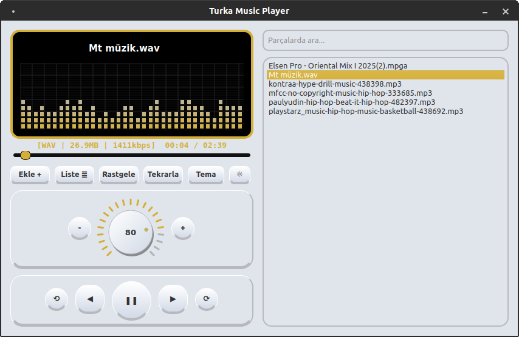
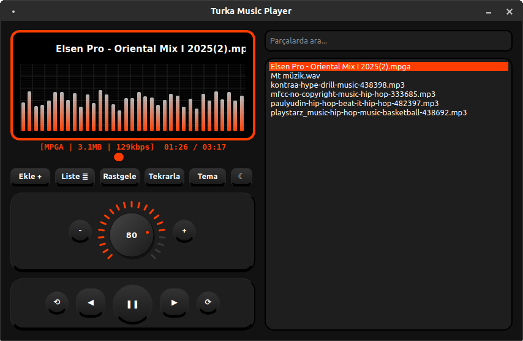

# Turka Music Player (TR)

Python ve Qt6 ile yazılmış basit ve hafif müzik çalar uygulamadır.

Debian tabanlı sistemler için .deb dosyası download link: https://github.com/03tekno/TurkaMP/releases/tag/current

Turka Music Player: Müziği Hisset, Görsel Şöleni Başlat! 🎶

Sıradan müzik çalarlardan sıkıldınız mı? Turka Music Player, minimalist tasarımı profesyonel ses görselleştirme (VU Meter) teknolojisiyle birleştiren, hem göze hem kulağa hitap eden yeni nesil bir medya oynatıcıdır. Python ve PyQt6 gücüyle geliştirilen bu uygulama, müzik dinleme deneyiminizi bir masaüstü sanatına dönüştürüyor.
Öne Çıkan Özellikler

10 Farklı Görselleştirme Modu: Dinamik spektrum paneline tek bir tıkla dokunarak 10 farklı animasyon modu arasında geçiş yapabilirsiniz. Klasik bar grafiklerinden dijital bloklara, dalga formlarından simetrik sanatsal çizimlere kadar müziğin ritmini her an farklı bir şekilde görün.

Profesyonel Ses Kontrolü: Analog hissi veren "Pro Volume Knob" (ses tekerleği) ile ses seviyesini hassas bir şekilde ayarlayın.

Geniş Format Desteği: .mp3 .wav .flac .m4a .mpga .aac .ogg .opus .wma .m4b .aiff .mid .amr içeren geniş bir ses formatı yelpazesini sorunsuz oynatın.

Modern ve Adaptif Arayüz: Tek tuşla Gece (Dark) ve Gündüz (Light) modları arasında geçiş yapın. Ayrıca 20'den fazla özel tema rengiyle oynatıcınızı kişiliğinize göre özelleştirin.

Akıllı Playlist Yönetimi: Sürükle-bırak desteği, gelişmiş arama barı ve otomatik kayıt özelliği sayesinde müzik kütüphanenizi zahmetsizce yönetin. Uygulamayı kapatsanız bile listeniz ve tercihleriniz bir sonraki açılışta sizi bekler.

Neden Turka Music Player?

Turka, sadece bir oynatıcı değil, aynı zamanda masaüstünüz için şık bir aksesuardır. Sürekli kayan şarkı isimleri, yumuşak geçişli animasyonlar ve kullanıcı dostu navigasyon tuşlarıyla müziğin kontrolü tamamen sizde.

"Müziği sadece dinlemeyin, Turka ile onun ritmini izleyin."
