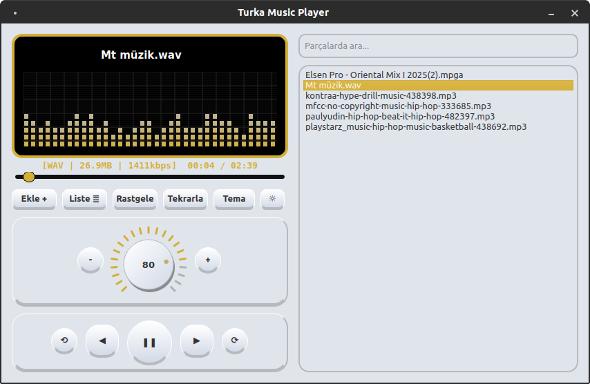
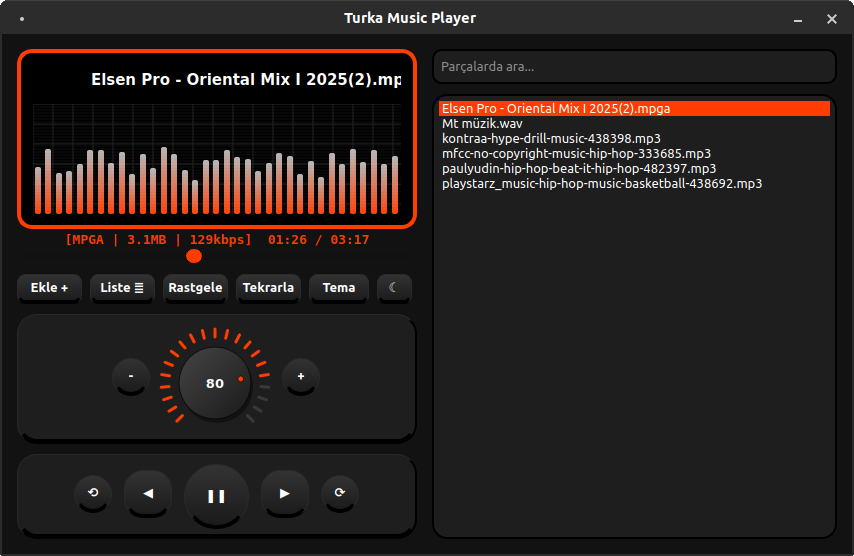

# Turka Music Player (TR)

PyQt6 ile yazılmış basit, hafif ve modern bir müzik çalar uygulamadır.

Turka Music Player .mp3 .wav .flac .m4a .mpga .aac .ogg .opus .wma .m4b .aiff .mid .amr .au .snd .ac3 .voc .mka uzantılı müzik dosyalarınızı oynatır.

Debian tabanlı sistemler için .deb dosyası download link: https://github.com/03tekno/TurkaMP/releases/tag/current

